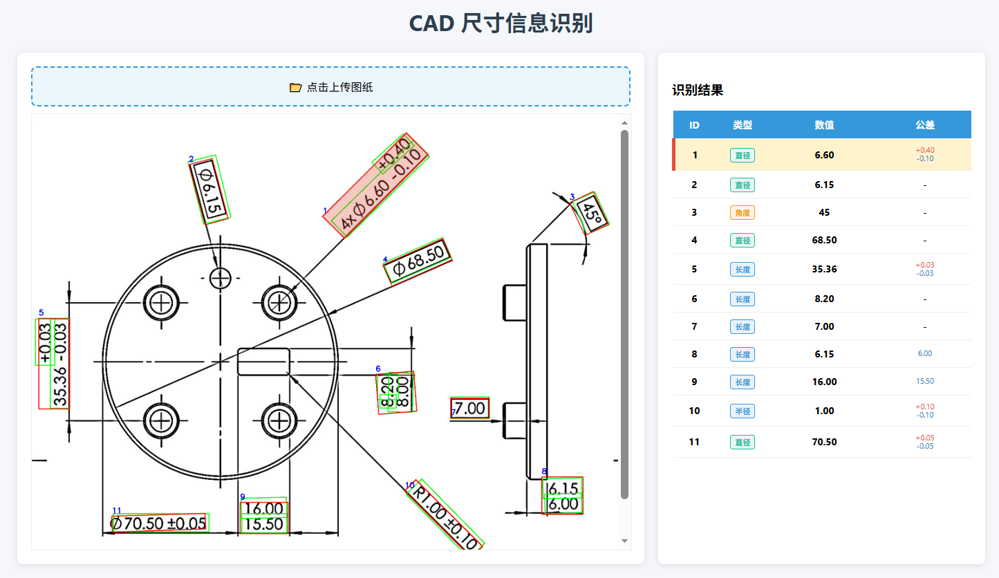
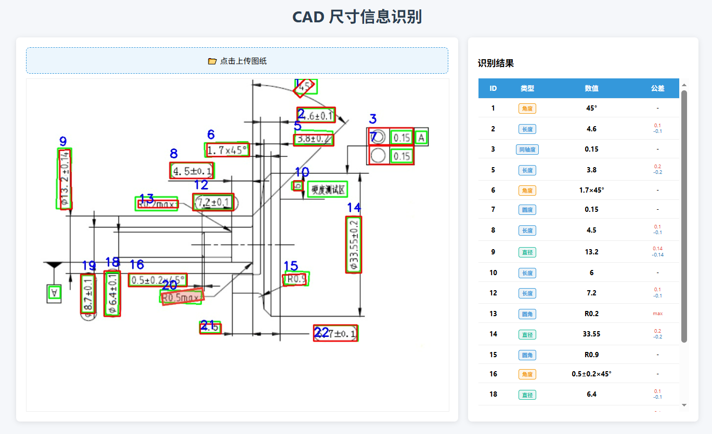
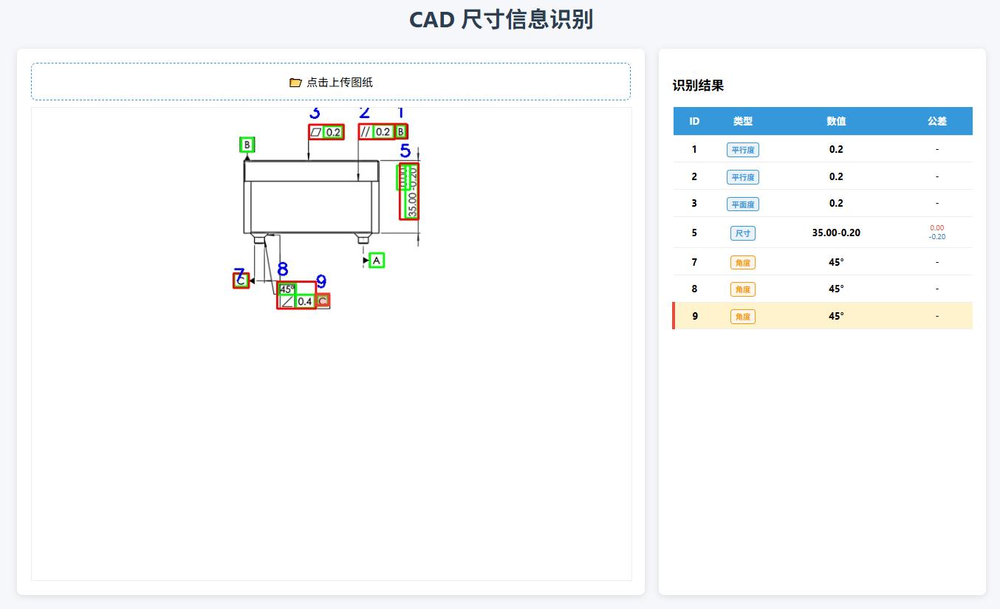

#  智能 CAD 图纸尺寸与形位公差提取系统 

本项目是一款结合了 **深度学习视觉算法** 与 **Web 交互技术** 的全栈图纸识别解决方案。它能够自动从 CAD 零件图纸（图片格式）中提取尺寸标注、公差信息以及复杂的形位公差符号，并生成结构化的 JSON 数据。

---

##  一.核心亮点

### 1. 智能算法后端 (AI Backend)
- **多角度 OCR 识别**：基于 **PaddleOCR** 深度定制，支持 CAD 图纸中常见的倾斜文字（如 45°、90° 标注）的精准捕捉。
- **几何符号检测**：集成自定义训练的 **YOLOv8** 模型，专门用于识别形位公差符号（同轴度、平面度、圆度、平行度等）。
- **AI 语义结构化**：集成 **阿里云 Qwen-VL-Max** 多模态大模型，通过 Prompt 工程将 OCR 识别的碎片化数据整合为标准的 `ID-类型-数值-公差` 结构。

### 2. 动态交互前端 (Interactive Frontend)
- **SVG 交互覆盖层**：利用 SVG `viewBox` 技术，在原始图纸上实时渲染高精度的旋转矩形多边形（Polygon）。
- **图表双向联动**：
    - **从图到表**：点击图片上的识别框，右侧表格自动滚动并高亮对应行。
    - **从表到图**：点击表格中的任意尺寸项，图片对应区域产生呼吸灯动效提示。
- **自适应坐标映射**：前端算法确保识别框在各种屏幕分辨率及缩放比例下，均能精准贴合原始标注位置。

---

##  二.效果演示




*(建议在项目根目录上传一张网页运行截图，展示左侧带框图片和右侧高亮表格的联动效果)*

---

##  三.技术架构

### 后端 (AI & API)
- **Python / FastAPI**: 高性能异步后端架构。
- **PaddleOCR**: 用于高精度文字定位与文本识别。
- **YOLOv8**: 用于非文字类几何公差符号的专项检测。
- **OpenCV**: 核心图像处理库，负责像素级掩膜收缩。

### 前端 (UI & Interaction)
- **HTML5 / CSS3**: 实现左右面板响应式布局。
- **Vanilla JavaScript**: 原生 JS 实现高性能 DOM 渲染与 Fetch API 异步通信。
- **SVG**: 用于实现复杂的非规整多边形覆盖层与交互。

---

##  四.快速部署

### 1. 克隆项目
```bash
git clone https://github.com/Leo-yang-318/Cad-Drawing-Analyzer.git
cd Cad-Drawing-Analyzer
```

### 2.后端环境搭建
```bash
# 创建虚拟环境
python -m venv venv

# 激活环境 (Windows 用户)
venv\Scripts\activate

# 激活环境 (Mac/Linux 用户)
# source venv/bin/activate

# 安装项目所需的所有依赖库（包括 PaddleOCR, OpenCV, FastAPI, Ultralytics 等）
pip install -r requirements.txt
```

### 3.配置API Key
在项目根目录手动新建一个名为 .env 的文本文件，并在其中填入阿里云 DashScope API Key（用于调用 Qwen-VL 大模型进行语义分析）：
```env
DASHSCOPE_API_KEY=你的真实API_KEY_填在这里
```

### 4.启动后端服务
在激活了虚拟环境的终端中，运行以下命令启动FastAPI服务：
```bash
uvicorn main:app --host 127.0.0.1 --port 8000
```
看到“Application startup complete”字样即表示后端启动成功

### 5.运行前端交互界面
在浏览器中打开项目根目录下的 index.html 文件即可访问UI界面并上传图纸进行测试


